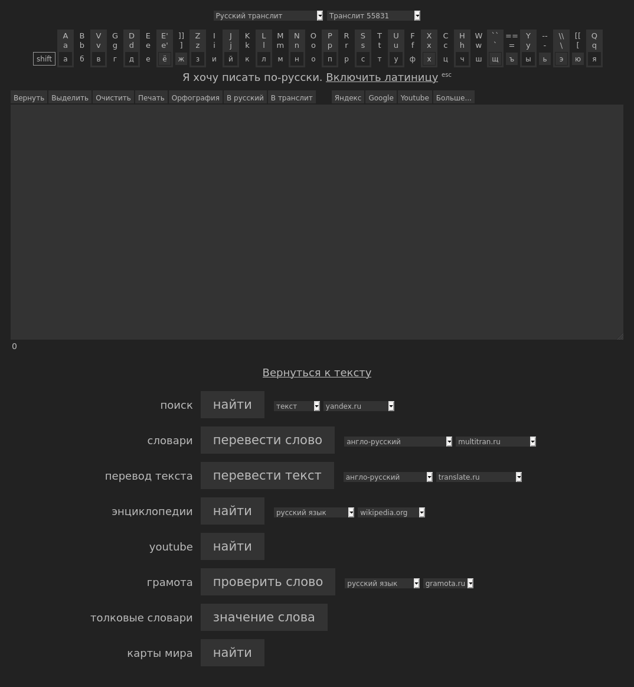

# translit-dark

> Dark Mode for Translit.net

## preview

## install
requires [Stylus](https://add0n.com/stylus.html) or similar

- [style.user.css](./style.user.css)
- https://userstyles.org/styles/164890/translit-net-dark

## mirrors
- https://github.com/dym-sh/translit-dark
- https://gitlab.com/dym-sh/translit-dark
- https://dym.sh/lab/translit-dark
- hyper://76fd64feb68e16ee91602616b019ac94a7e4478014d2314ceba1ccece0c7fc9d /[?](https://beakerbrowser.com)

## tags
- #userstyle
- #dark_mode
- #css

## license
[mit](license)
